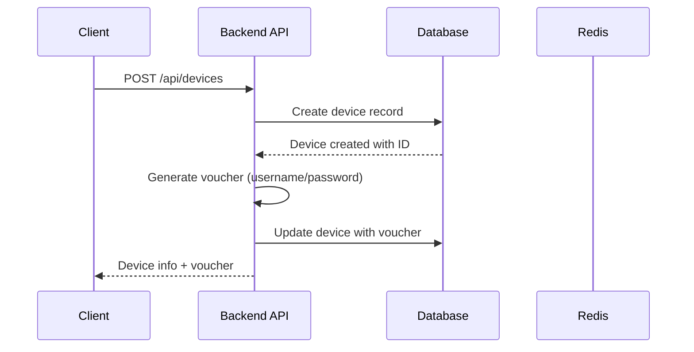
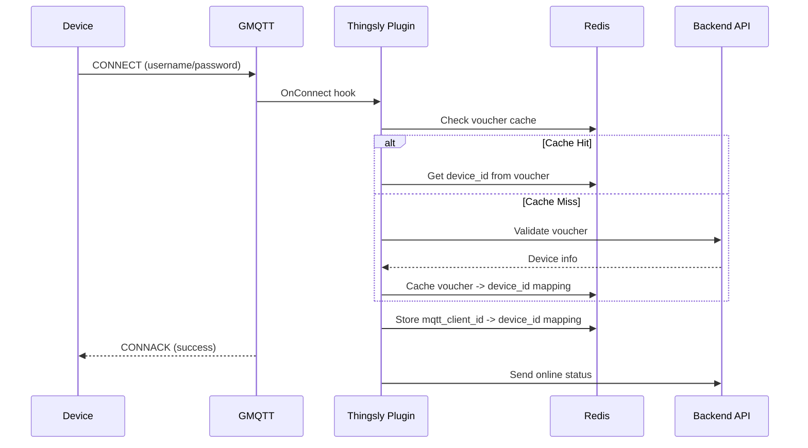
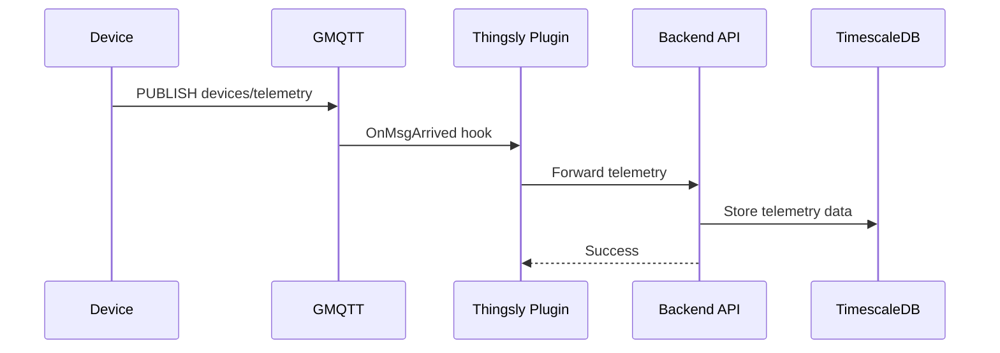

# Luồng Dữ Liệu Khi Tạo Device Mới và Vai Trò của GMQTT

## Tổng Quan Hệ Thống

Hệ thống IoT Thingsly sử dụng kiến trúc microservices với các thành phần chính:
- **Backend API**: Xử lý business logic và quản lý device
- **GMQTT Broker**: MQTT broker tùy chỉnh với plugin authentication
- **Redis Cache**: Lưu trữ mapping và cache
- **TimescaleDB**: Lưu trữ telemetry data
- **Device**: Thiết bị IoT kết nối qua MQTT

## 1. Luồng Tạo Device Mới

### 1.1. Tạo Device qua API



**Chi tiết:**
- Device được tạo trong database với thông tin cơ bản
- Hệ thống tự động sinh voucher chứa username/password cho MQTT authentication
- Voucher được lưu trong trường `voucher` của device dưới dạng JSON:
  ```json
  {
    "username": "8cc60abf-40ab-b725-6d9",
    "password": "b7e693c"
  }
  ```

### 1.2. Voucher Generation

```go
// Từ backend/internal/service/device.go
result := model.GatewayRegisterRes{
    MqttUsername: uuid.New()[0:22],  // 22 ký tự
    MqttPassword: uuid.New()[0:7],   // 7 ký tự
    MqttClientId: uuid.New(),        // Full UUID
}
```

## 2. Luồng Kết Nối Device

### 2.1. Device Authentication với GMQTT



### 2.2. Client ID Generation

Khi device kết nối mà không cung cấp Client ID, GMQTT tự động sinh:

```go
// Từ thingsly-gmqtt/server/client.go
func getRandomUUID() string {
    var b [12]byte
    // Timestamp (4 bytes)
    binary.BigEndian.PutUint32(b[:], uint32(time.Now().Unix()))
    // Machine ID (3 bytes) - MD5(hostname)
    b[4] = machineID[0]
    b[5] = machineID[1] 
    b[6] = machineID[2]
    // Process ID (2 bytes)
    b[7] = byte(pid >> 8)
    b[8] = byte(pid)
    // Counter (3 bytes)
    i := atomic.AddUint32(&counter, 1)
    b[9] = byte(i >> 16)
    b[10] = byte(i >> 8)
    b[11] = byte(i)
    return fmt.Sprintf(`%x`, string(b[:]))
}
```

**Ví dụ:** `5dbd366d-e4b5-86f9-76d5-d03e8c5f25af`

### 2.3. Redis Cache Mapping

```go
// Từ thingsly-gmqtt/plugin/thingsly/hooks.go
err = SetStr("mqtt_client_id_"+string(req.Connect.ClientID), device.ID, 0)
```

**Redis Key:** `mqtt_client_id_5dbd366d-e4b5-86f9-76d5-d03e8c5f25af`

**Redis Value:** `device_id`

## 3. Cache Voucher trong Redis

### 3.1. Mục Đích của Voucher Cache

Cache voucher trong Redis có các tác dụng chính:

#### **3.1.1. Tăng Tốc Độ Authentication**
- **Giảm Database Queries**: Thay vì query database mỗi lần device kết nối
- **Low Latency**: Redis access nhanh hơn database query
- **High Throughput**: Xử lý hàng nghìn device connections đồng thời

#### **3.1.2. Giảm Tải Database**
- **Connection Pool**: Giảm số lượng database connections
- **Query Optimization**: Tránh repeated queries cho cùng voucher
- **Resource Management**: Tiết kiệm CPU và I/O resources

#### **3.1.3. Scalability**
- **Horizontal Scaling**: GMQTT instances có thể share cache
- **Load Distribution**: Phân tán authentication load
- **Fault Tolerance**: Cache persistence và recovery

### 3.2. Cấu Trúc Cache Voucher

```go
// Từ thingsly-gmqtt/plugin/thingsly/db.go
func GetDeviceByVoucher(voucher string) (*Device, error) {
    var device Device
    
    // 1. Check Redis cache first
    deviceId, _ := GetStr(voucher)
    Log.Debug("Cached device ID: " + deviceId)
    
    if deviceId == "" {
        // 2. Cache miss - query database
        result := db.Model(&Device{}).Where("voucher = ?", voucher).First(&device)
        if result.Error != nil {
            return nil, result.Error
        }
        
        // 3. Cache voucher -> device_id mapping
        if err := SetStr(voucher, device.ID, 0); err != nil {
            return nil, err
        }
        
        // 4. Cache full device info
        if err := SetRedisForJsondata(device.ID, device, 0); err != nil {
            return nil, err
        }
    } else {
        // 5. Cache hit - get device info
        d, err := GetDeviceById(deviceId)
        if err != nil {
            return nil, err
        }
        device = *d
    }
    
    return &device, nil
}
```

### 3.3. Cache Key Patterns

```
# Voucher -> Device ID mapping
voucher_json -> device_id

# Device info cache
device_id -> device_object_json

# MQTT Client mapping
mqtt_client_id_{client_id} -> device_id
```

**Ví dụ:**
```
Key: {"username":"8cc60abf-40ab-b725-6d9","password":"b7e693c"}
Value: device_12345

Key: device_12345
Value: {"id":"device_12345","name":"Sensor01","voucher":"{...}"}
```

### 3.4. Cache Invalidation

#### **3.4.1. Khi Update Voucher**
```go
// Từ backend/internal/service/device.go
func (*Device) UpdateDeviceVoucher(ctx context.Context, param *model.UpdateDeviceVoucherReq) (string, error) {
    // ... update database
    
    // Clear device cache
    initialize.DelDeviceCache(param.DeviceID)
    
    // Clear old voucher cache if changed
    if deviceInfo.Voucher != voucher {
        global.REDIS.Del(ctx, deviceInfo.Voucher)
    }
    
    return info.Voucher, err
}
```

#### **3.4.2. Khi Delete Device**
```go
// Clear all related caches
initialize.DelDeviceCache(deviceId)
global.REDIS.Del(ctx, device.Voucher)
```

### 3.5. Cache Performance Metrics

#### **3.5.1. Hit Rate**
- **Target**: >90% cache hit rate
- **Monitoring**: Redis INFO command
- **Optimization**: TTL và cache size tuning

#### **3.5.2. Latency**
- **Cache Hit**: <1ms
- **Cache Miss**: ~10-50ms (database query)
- **Database Query**: ~100-500ms

#### **3.5.3. Throughput**
- **Redis**: 100,000+ operations/second
- **Database**: 1,000-10,000 queries/second
- **Improvement**: 10-100x performance boost

### 3.6. Cache Management

#### **3.6.1. TTL (Time To Live)**
```go
// Voucher cache - no expiration (until invalidated)
SetStr(voucher, device.ID, 0)

// Device info cache - no expiration
SetRedisForJsondata(device.ID, device, 0)

// MQTT client mapping - session-based
SetStr("mqtt_client_id_"+clientID, device.ID, 0)
```

#### **3.6.2. Memory Management**
```go
// Redis configuration
maxmemory: 1gb
maxmemory-policy: allkeys-lru
```

#### **3.6.3. Backup và Recovery**
```bash
# Redis persistence
save 900 1
save 300 10
save 60 10000
```

## 4. Luồng Telemetry Data

### 4.1. Device Gửi Telemetry



### 4.2. Telemetry Processing

```go
// Từ thingsly-gmqtt/plugin/thingsly/hooks.go
func (t *Thingsly) OnMsgArrivedWrapper(pre server.OnMsgArrived) server.OnMsgArrived {
    return func(ctx context.Context, client server.Client, req *server.MsgArrivedRequest) error {
        // Forward telemetry to backend
        if err := DefaultMqttClient.SendData("devices/telemetry", req.Message.Payload); err != nil {
            return err
        }
        return nil
    }
}
```

### 4.3. Backend Processing

```go
// Từ backend/mqtt/subscribe/telemetry.go
func TelemetryMessageHandler(client mqtt.Client, msg mqtt.Message) {
    // Parse telemetry data
    // Store to TimescaleDB
    // Trigger automations/alarms
}
```

## 5. Vai Trò Của GMQTT

### 5.1. MQTT Broker Tùy Chỉnh

GMQTT là MQTT broker được tùy chỉnh với các tính năng:

- **Authentication Plugin**: Tích hợp với backend API
- **Message Routing**: Định tuyến message giữa device và backend
- **Session Management**: Quản lý session và connection
- **Redis Integration**: Cache mapping và configuration

### 5.2. Plugin Architecture

```go
// Plugin hooks trong GMQTT
type Thingsly struct {
    OnConnect     server.OnConnect
    OnConnected   server.OnConnected  
    OnMsgArrived  server.OnMsgArrived
    OnDisconnect  server.OnDisconnect
}
```

### 5.3. Authentication Flow

```go
// Từ thingsly-gmqtt/plugin/thingsly/hooks.go
func (t *Thingsly) OnConnectWrapper(pre server.OnConnect) server.OnConnect {
    return func(ctx context.Context, client server.Client, req *server.ConnectRequest) error {
        voucher := string(req.Connect.Username)
        device, err := GetDeviceByVoucher(voucher)
        if err != nil {
            return err
        }
        // Store mapping in Redis
        err = SetStr("mqtt_client_id_"+string(req.Connect.ClientID), device.ID, 0)
        return err
    }
}
```

## 6. Cache Management

### 6.1. Redis Database Structure

- **DB 1**: Backend cache (automation, alarm, device cache)
- **DB 1**: GMQTT cache (client mapping, session data)

### 6.2. Key Patterns

```
# Device mapping
mqtt_client_id_{client_id} -> device_id

# Device cache  
device:{device_id} -> device_info

# Voucher cache
voucher_json -> device_id

# Automation cache
automation:{automation_id} -> automation_config

# Alarm cache
alarm:{alarm_id} -> alarm_config
```

## 7. Status Management

### 7.1. Online Status

```go
// Khi device kết nối
func (t *Thingsly) OnConnectedWrapper(pre server.OnConnected) server.OnConnected {
    return func(ctx context.Context, client server.Client) {
        deviceId, err := GetStr("mqtt_client_id_" + client.ClientOptions().ClientID)
        if err != nil {
            return
        }
        // Send online status
        if err := DefaultMqttClient.SendData("devices/status/"+deviceId, []byte("1")); err != nil {
            Log.Warn("Failed to report status")
        }
    }
}
```

### 7.2. Offline Status

```go
// Khi device disconnect
func (t *Thingsly) OnDisconnectWrapper(pre server.OnDisconnect) server.OnDisconnect {
    return func(ctx context.Context, client server.Client, err error) {
        deviceId, err := GetStr("mqtt_client_id_" + client.ClientOptions().ClientID)
        if err != nil {
            return
        }
        // Send offline status
        if err := DefaultMqttClient.SendData("devices/status/"+deviceId, []byte("0")); err != nil {
            Log.Warn("Failed to report status")
        }
    }
}
```

## 8. Monitoring và Debugging

### 8.1. Log Monitoring

```bash
# GMQTT logs
docker logs gmqtt

# Backend logs  
docker logs backend

# Redis monitoring
redis-cli -n 1 keys "*mqtt_client_id*"
redis-cli -n 1 keys "*voucher*"
```

### 8.2. Database Queries

```sql
-- Check device status
SELECT id, name, is_online, created_at 
FROM devices 
WHERE id = 'device_id';

-- Check telemetry data
SELECT * FROM telemetry 
WHERE device_id = 'device_id' 
ORDER BY timestamp DESC 
LIMIT 10;
```
