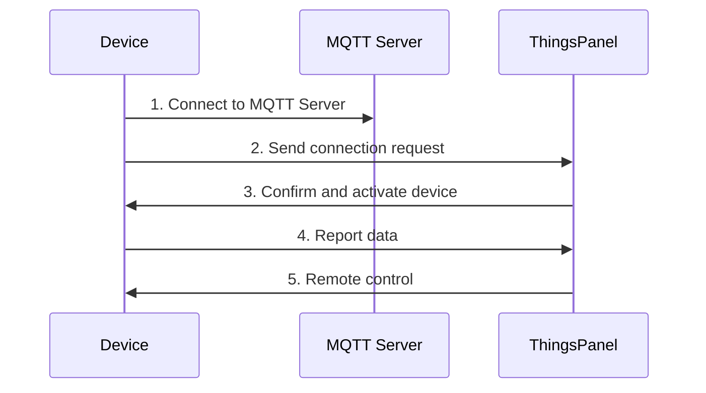

# Gateway Device MQTT Data Interaction Specification

## Overview

This specification describes the requirements for gateway devices to connect to Thingsly via the MQTT protocol, defining the format and process of data interaction between devices and the platform.

Important Notes

* **message\_id** is a message identifier. It should not repeat in the short term. The last 7 digits of a millisecond timestamp is a suggested strategy, though the length is not strictly limited.
* **device\_number** is the unique device identifier, which can be modified by the platform.
* **sub\_device\_address** is the unique sub-device address under a gateway, modifiable by the platform.
* Core data interaction types include: **telemetry, attributes, events, and commands**.

Flexibility

* **Subscribe and Publish** - Devices can choose to subscribe or publish based on actual needs.
* **Response Mechanism** - Device responses are optional and can be implemented based on business needs.
* **Payload Format** - Non-standard payloads are also supported and can be converted via platform scripts.

## Device Requirements

Devices must support:

* ✅ MQTT client capabilities
* ✅ Network connectivity and stable operation

## Integration Steps



1. **Register Device** - Create device in Thingsly and get configuration
2. **Establish Connection** - Device connects to the MQTT server
3. **Send Request** - Device sends a connection request message
4. **Activation Confirmation** - Thingsly confirms and activates the device
5. **Data Exchange** - Device reports data and receives platform control commands

## MQTT Topic Specification

### Device Publish Topics (Platform Subscribes)

| Topic                                          | Description             | Data Type  | Required |
| ---------------------------------------------- | ----------------------- | ---------- | -------- |
| `gateway/telemetry`                            | Telemetry data upload   | Telemetry  | Optional |
| `gateway/attributes/{message_id}`              | Attribute status upload | Attributes | Optional |
| `gateway/event/{message_id}`                   | Event data upload       | Event      | Optional |
| `gateway/command/response/{message_id}`        | Command response        | Response   | Optional |
| `gateway/attributes/set/response/{message_id}` | Attribute set response  | Response   | Optional |

### Device Subscribe Topics (Platform Publishes)

Topic Placeholder
**Note:** `+` is a placeholder for `message_id`, and its length is not limited.

| Topic                                           | Description                             | Data Type       | Required |
| ----------------------------------------------- | --------------------------------------- | --------------- | -------- |
| `gateway/telemetry/control/{device_number}`     | Receive telemetry control command       | Control         | Optional |
| `gateway/attributes/set/{device_number}/+`      | Receive attribute set command           | Attribute Set   | Optional |
| `gateway/attributes/get/{device_number}`        | Receive attribute query request         | Attribute Query | Optional |
| `gateway/command/{device_number}/+`             | Receive command execution request       | Command         | Optional |
| `gateway/attributes/response/{device_number}/+` | Receive attribute response confirmation | Response Ack    | Optional |
| `gateway/event/response/{device_number}/+`      | Receive event response confirmation     | Response Ack    | Optional |

## Data Interaction Format

### 1. Telemetry Data Upload

**Topic:** `gateway/telemetry`

```json title="Telemetry Data Example"
{
  "gateway_data": {
    "temperature": 28.5,
    "version": "v0.1",
    "switch": true
  },
  "sub_device_data": {
    "28da4985": {
      "temperature": 28.5,
      "version": "v0.1",
      "switch": true
    },
    "sub_device_address2": {
      "temperature": 28.5,
      "version": "v0.1",
      "switch": true
    }
  }
}
```

### 2. Attribute Data Upload

**Topic:** `gateway/attributes/{message_id}`

```json title="Attribute Data Example"
{
  "gateway_data": {
    "ip": "127.0.0.1",
    "version": "v0.1"
  },
  "sub_device_data": {
    "sub_device_address1": {
      "ip": "127.0.0.1",
      "version": "v0.1"
    },
    "sub_device_address2": {
      "ip": "127.0.0.1",
      "version": "v0.1"
    }
  }
}
```

### 3. Event Data Upload

**Topic:** `gateway/event/{message_id}`

```json title="Event Data Example"
{
  "gateway_data": {
    "method": "FindAnimal",
    "params": {
      "count": 2,
      "animalType": "cat"
    }
  },
  "sub_device_data": {
    "sub_device_address1": {
      "method": "FindAnimal",
      "params": {
        "count": 2,
        "animalType": "cat"
      }
    },
    "sub_device_address2": {
      "method": "FindAnimal",
      "params": {
        "count": 2,
        "animalType": "cat"
      }
    }
  }
}
```

### 4. Receive Control Command

**Topic:** `gateway/telemetry/control/{device_number}`

```json title="Control Command Example"
{
  "gateway_data": {
    "temperature": 28.5,
    "version": "v0.1",
    "switch": true
  },
  "sub_device_data": {
    "sub_device_address1": {
      "temperature": 28.5,
      "version": "v0.1",
      "switch": true
    },
    "sub_device_address2": {
      "temperature": 28.5,
      "version": "v0.1",
      "switch": true
    }
  }
}
```

### 5. Receive Attribute Set

**Topic:** `gateway/attributes/set/{device_number}/+`

```json title="Attribute Set Example"
{
  "gateway_data": {
    "ip": "127.0.0.1",
    "version": "v0.1"
  },
  "sub_device_data": {
    "sub_device_address1": {
      "ip": "127.0.0.1",
      "version": "v0.1"
    },
    "sub_device_address2": {
      "ip": "127.0.0.1",
      "version": "v0.1"
    }
  }
}
```

### 6. Receive Attribute Query Request

**Topic:** `gateway/attributes/get/{device_number}`

**Query All Attributes:**

```json title="Query All Attributes"
{
  "gateway_data": []
}
```

**Query Specific Attributes:**

```json title="Query Specific Attributes"
{
  "gateway_data": [],
  "sub_device_data": {
    "sub_device_address1": ["temp", "hum"],
    "sub_device_address2": ["temp", "hum"]
  }
}
```

### 7. Receive Command Execution Request

**Topic:** `gateway/command/{device_number}/+`

```json title="Command Execution Example"
{
  "gateway_data": {
    "method": "FindAnimal",
    "params": {
      "count": 2,
      "animalType": "cat"
    }
  },
  "sub_device_data": {
    "sub_device_address1": {
      "method": "FindAnimal",
      "params": {
        "count": 2,
        "animalType": "cat"
      }
    },
    "sub_device_address2": {
      "method": "FindAnimal",
      "params": {
        "count": 2,
        "animalType": "cat"
      }
    }
  }
}
```

## Response Format Specification

### Parameters

| Field     | Required | Type   | Description                                    |
| --------- | -------- | ------ | ---------------------------------------------- |
| `result`  | ✅        | number | Execution result: `0` - success, `1` - failure |
| `errcode` | ❌        | string | Error code (if failed)                         |
| `message` | ✅        | string | Response message                               |
| `ts`      | ❌        | number | Timestamp (seconds)                            |
| `method`  | ❌        | string | Method name for event or command               |

### Example

**Success Response:**

```json title="Success"
{
  "result": 0,
  "message": "success",
  "ts": 1609143039
}
```

**Failure Response:**

```json title="Failure"
{
  "result": 1,
  "errcode": "INVALID_PARAM",
  "message": "Invalid parameter value",
  "ts": 1609143039,
  "method": "ReSet"
}
```

**Success with Method:**

```json title="Success with Method"
{
  "result": 0,
  "message": "Command executed successfully",
  "ts": 1609143039,
  "method": "ReSet"
}
```

## Script Conversion Support

Custom Format Support

The platform supports non-standard payload formats via:

1. **Script Conversion** - Configure scripts to transform custom formats into the standard structure.
2. **Flexible Integration** - Devices can use existing formats without forced changes.
3. **Field Mapping** - Implement field mapping and value conversion via scripts.
4. **Compatibility** - Maintain device protocol while ensuring platform data conformity.

## Best Practices

Development Tips

1. **Message ID Management** - Suggested to use timestamp's last 7 digits; avoid repetition.
2. **Optional Features** - Implement publish/subscribe/response as per your business logic.
3. **Data Validation** - Validate JSON format before sending.
4. **Keep Alive** - Use MQTT keep-alive mechanism.
5. **Reconnection Strategy** - Implement auto-reconnect for network errors.
6. **Script Use** - For existing devices, use scripts to adapt formats.

Notes

* Ensure unique `device_number` in the system.
* Telemetry data should be reported periodically to avoid loss.
* If response mechanism is implemented, confirm responses after command execution.
* Validate parameters before applying attribute settings.
* Although non-standard messages are supported, standard format is preferred for better performance.
