# Báo cáo đồ án tốt nghiệp lần 3

I. Xử lý các việc trong buổi gặp thầy lần trước

Thêm swagger UI đầy đủ cho API Device

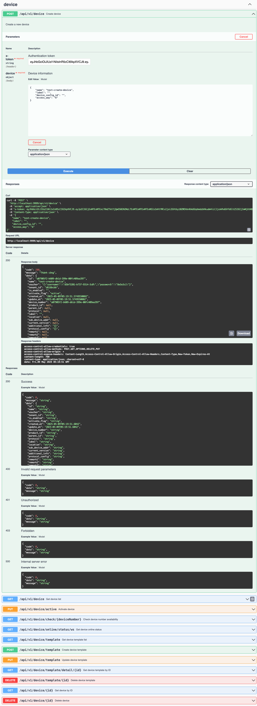

1. Hoàn thành cơ chế phát hiện ON/OFF của thiết bị để không phụ thuộc vào tối đa bản thân thiết bị đó -> Platform sẽ đảm đương chủ động làm

Chi tiết tại: https://github.com/Thingsly/backend/blob/main/docs/device-status.md

2. Đã bổ sung các metrics cho backend để phục vụ monitor tạo dashboard grafana phủ lên như thầy nói

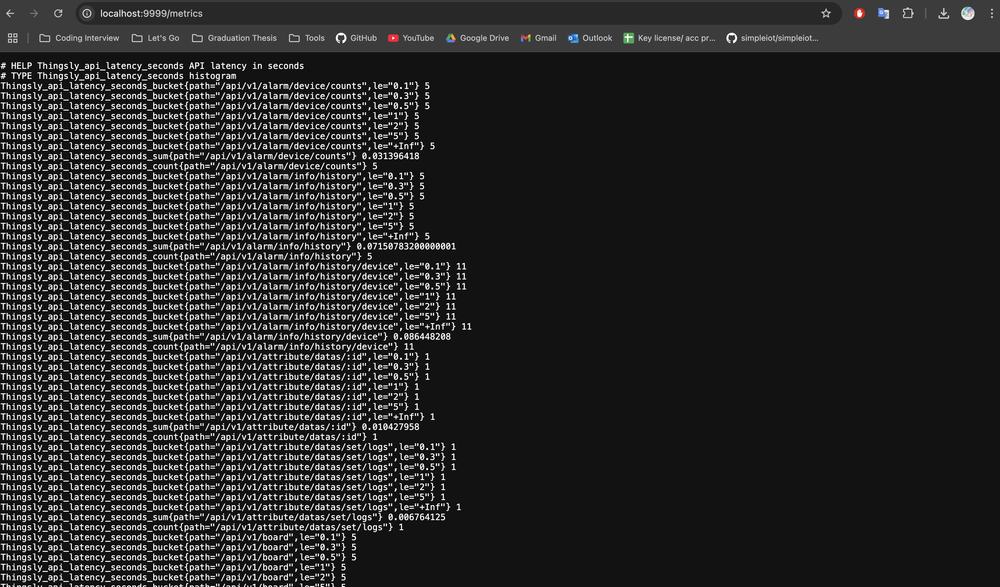

3. Từ metrics trên tạo được giao diện grafana để hiển thị các metrics của backend

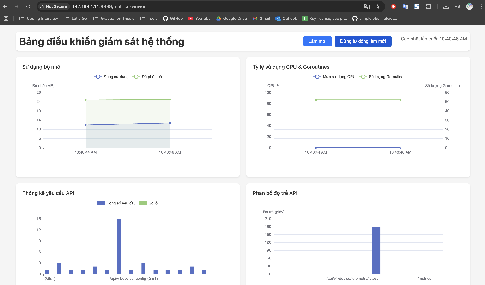

4. Hoàn thành việc tạo ra các API cho việc quản lý thiết bị, người dùng, nhóm thiết bị, nhóm người dùng như báo cáo đồ án lần 1 đề ra và hoàn thành 1 phần UI

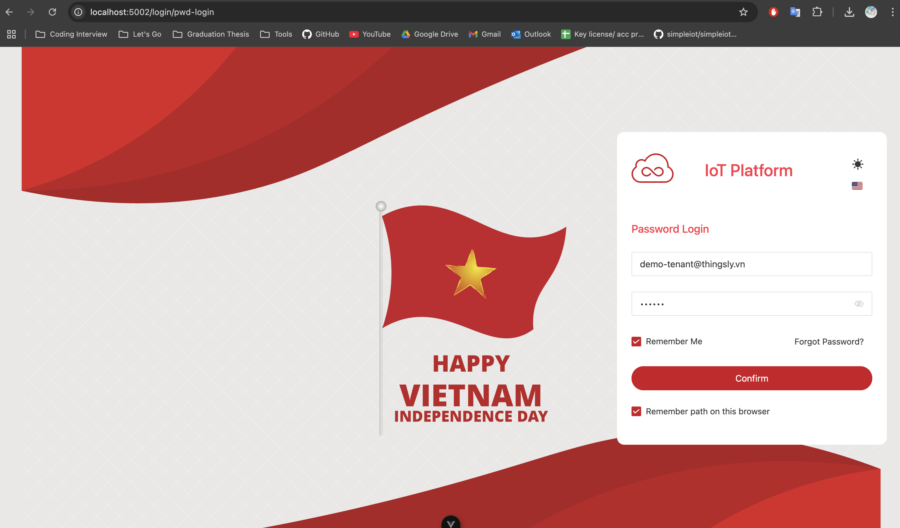

Nghiệp vụ 3 bước tạo ra 1 thiết bị như sau:

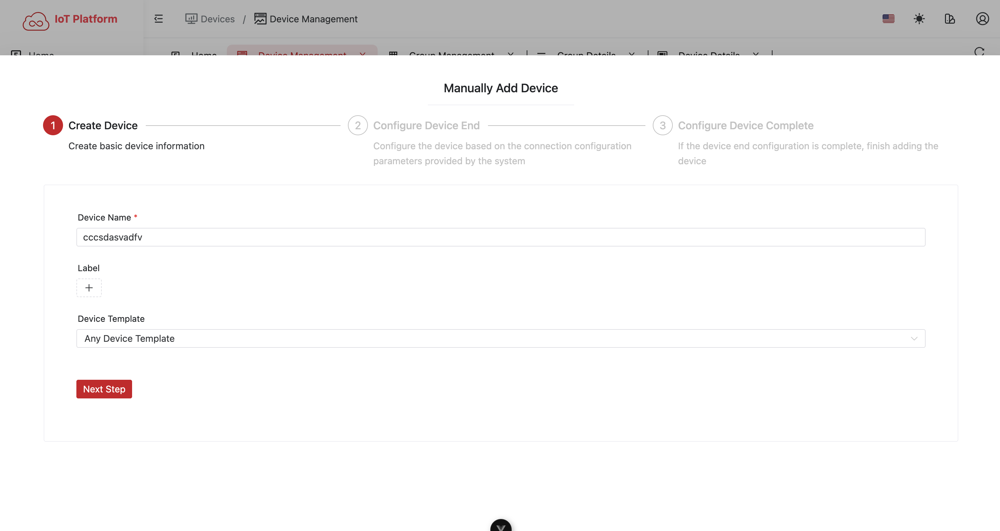

Có thể group các thiết bị lại với nhau để quản lý dễ hơn, ví dụ như 1 cái nhà có nhiều thiết bị thì có thể group lại thành 1 cái nhà

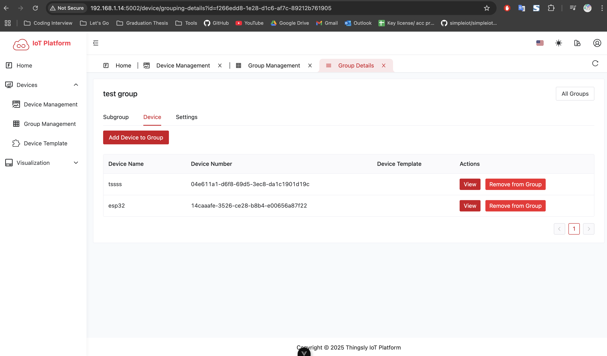

5. Hoàn thành nghiệp vụ tạo device trên giao diện cũng như có cái tool simulate data để test

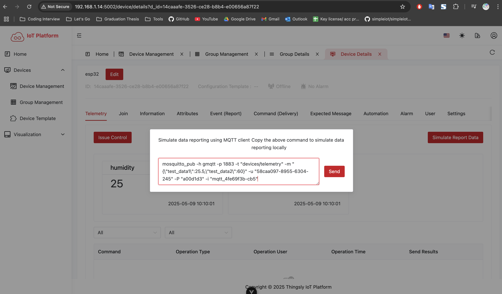

6. Giả lập bắn dữ liệu từ thiết bị lên platform có thể sử dụng 2 cách là dùng fake data bắn từ backend lên hoặc thiết lập qua Wowki 
   - Fake data: sử dụng tool simulate data để bắn dữ liệu lên platform -> Tại sao cần fake data? Vì có thể test được các trường hợp như thiết bị không hoạt động, thiết bị hoạt động không ổn định, thiết bị hoạt động bình thường, thiết bị không kết nối được với platform và dữ liệu abnormal bắn lên platform phục vụ cho alerting sau này
   - Wowki: sử dụng giao thức MQTT để bắn dữ liệu lên platform -> Wowki luôn ở trạng thái `server bận` nên e phải tạo ra cái fake data trên

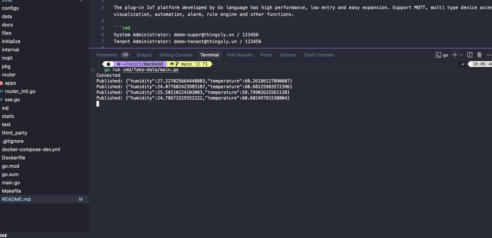

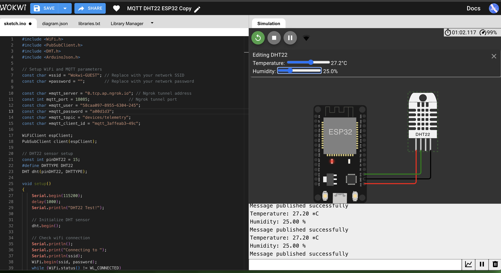

Khi bắn xong thì sẽ như sau

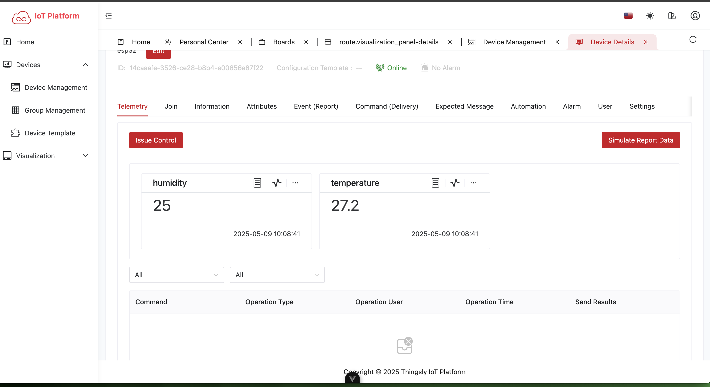

7. Sau khi có dữ liệu từ thiết bị lên platform thì sẽ có dashboard để hiển thị các thông số của thiết bị như nhiệt độ, độ ẩm, trạng thái thiết bị, thời gian hoạt động của thiết bị, thời gian kết nối với platform -> Tuy nhiên còn nhiều card chưa xong ví dụ như mấy cái liên quan đến tắt/bật đèn, mấy cái dữ liệu timeseries thì còn phải làm thêm
   
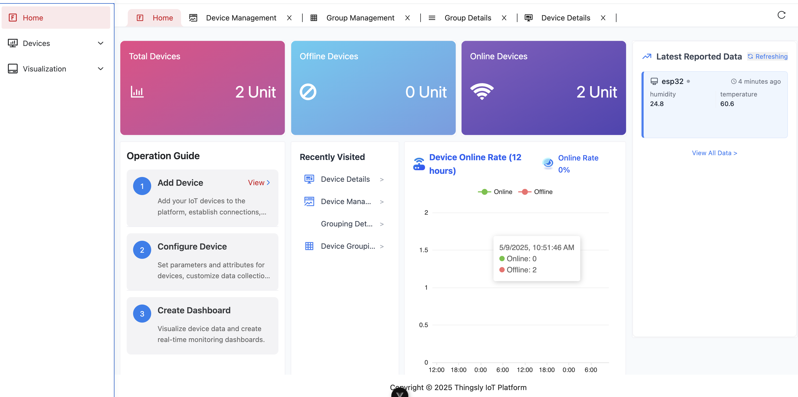

II. Các việc cần làm tiếp theo

- Hoàn thành đống API còn lại alerting, automation, notification, dashboard,...
- Hoàn thành UI alerting, automation, notification, dashboard,...
- Hoàn thành UI cho ông Admin
- Hoàn thành nghiệp vụ Device Template - nghĩa là định nghĩa trước các thông số của thiết bị cha để sau này có thể thêm thiết bị mới mà không cần phải cấu hình lại
- Hoàn thành thêm các tutorial về việc sử dụng các thiết bị gateway với sensor khác nhau như: 
  - ESP8266 + DHT22 độ ẩm nhiệt độ
  - ESP8266 + SGP30 cảm biến khí ga
  - ESP8266 + BME280 cảm biến khí áp
  - ESP8266 + BH1750 cảm biến ánh sáng 
  - ESP8266 + MQ2 cảm biến khí ga
  - ESP8266 + Relay bật tắt thiết bị
  
  -> Khi đó tạo ra 1 library arduino để kết nối với platform để người dùng có thể sử dụng dễ dàng hơn (Việc này e xin làm cuối để hoàn thiện nốt cái platform) + cũng cần tham khảo thêm cái phát wifi của thầy 